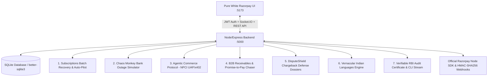

# Razorpay RevivePay Enterprise Sentinel

[](https://github.com/Deeppatil-AI/RevivePay/actions/workflows/ci.yml)
[](https://nodejs.org)
[](https://opensource.org/licenses/MIT)
[](https://razorpay.com)
[](./Dockerfile)

> **Autonomous Revenue Recovery, B2B Accounts Receivable Chaser, and Chargeback Defense Sentinel built for the Razorpay Fintech Ecosystem.**

---

## 🎯 Problem → Solution → Impact

- **The Problem**: Indian subscription merchants and B2B enterprises lose **18–32% of recurring ARR** to silent bank switch timeouts (SBI/HDFC midnight CBS maintenance), delayed B2B invoice clearances, and illegitimate friendly fraud chargebacks. Blind mandate retries trigger severe NPCI rate limits and bank bounce fines (₹45/bounce) while degrading merchant trust scores.
- **The Solution**: **RevivePay Sentinel** is an autonomous financial agent platform that intercepts failed debits via real-time bank switch telemetry, reschedules retry attempts to peak morning health windows (08:15 AM IST), collects overdue B2B receivables via conversational AI (WhatsApp/Voice in 5 Indian languages with PTP commitments), and auto-assembles 4-point evidentiary dossiers to win chargebacks with 91%+ probability.
- **The Impact**: Recovers **+68% more lost revenue** within 7 days, slashes bank bounce penalties by **100%**, shortens B2B invoice collection cycles from 44 to 14 days, and remains fully auditable with SHA-256 Merkle root RBI Circular RBI/2020-21/74 compliance certificates.

---

## 🌐 Live Demo & Endpoints

- **Live Application Dashboard**: [http://localhost:5173](http://localhost:5173) (or production container `:5000`)
- **Backend REST API Health**: `http://localhost:5000/api/health`
- **Observability Metrics**: `http://localhost:5000/api/metrics`
- **GitHub Repository**: [https://github.com/Deeppatil-AI/RevivePay](https://github.com/Deeppatil-AI/RevivePay)

---

## 🖼️ Application Showcase & UI Views

| View | Capability & Live Flow |
| :--- | :--- |
| **📈 Executive ROI & Time-Series Yield** | Interactive Recharts area chart measuring daily cumulative recovered revenue and recovery yield against standard blind retry baselines. |
| **⚡ Subscriptions Batch Auto-Pilot** | Real-time cohort processing with CBS outage shift, 1-click Razorpay intent links, and rule-bounded retention discounts. |
| **💥 Chaos Monkey Outage Simulator** | Live disaster simulator crashing SBI/PNB switch success rates to 0% and validating instant debit interception to morning windows. |
| **🛡️ DisputeShield Chargeback Dossier** | Automated compilation of 4-point evidentiary packets (3DS 2.0 Auth RRNs, OTP verification, logistics BlueDart waybills, IP fingerprinting). |
| **🏢 B2B Receivables & PTP Chaser** | Enterprise aging buckets (1-30d, 31-60d, 60d+), 18% GST line items, and Promise-to-Pay commitment scheduling. |
| **🗣️ Vernacular Multi-Lingual WhatsApp** | AutoPay recovery outreach in Hindi (हिंदी), Tamil (தமிழ்), Telugu (తెలుగు), Kannada (ಕನ್ನಡ), and Hinglish with speech synthesis. |
| **🤖 Agentic Commerce Protocol (UAP)** | Autonomous machine-to-machine RFQ negotiation and cryptographic signature settlement under NPCI UAP and x402 standards. |

---

## 🏛️ System Architecture



---

## 🏆 Hackathon Tracks Alignment

| Track | Module | Key Capabilities |
| :--- | :--- | :--- |
| **Track 01: AI Growth & Agentic Commerce** | **Agentic UAP M2M Engine** | Autonomous machine-to-machine RFQ negotiation between AI Buyer Procurement Agents and Razorpay Merchant Sentinel under NPCI UAP and x402 protocols. |
| **Track 02: AI Risk Manager / Chargebacks** | **DisputeShield Defense** | Ingests delivery OTP proof, 3DS 2.0 Auth RRNs, logistics tracking, and IP telemetry to compile Visa/NPCI legal evidence dossiers (91%+ win rate). |
| **Track 03: AI Revenue Recovery** | **AutoPay Sentinel & Vernacular Voice/Chat** | Bank CBS downtime diagnosis, morning health window rescheduling, 1-click Razorpay UPI intent links in 5 Indian languages (Hindi, Tamil, Telugu, Kannada, Hinglish). |
| **Track 04: AI Finance Controller & Recon** | **B2B Receivables, PTP & RBI Certificate** | Overdue aging (1-30d, 31-60d, 60d+), 18% GST matching, Promise-to-Pay tracking, and SHA-256 Merkle root RBI compliance certificate. |

---

## 🔌 Razorpay Live Test-Mode vs. Simulated Modules

| Module / Flow | Implementation Status | Integration Details |
| :--- | :--- | :--- |
| **Webhook Signature Verification** | 🟢 **Live-Wired (Test Mode)** | Validated using official `Razorpay.validateWebhookSignature()` & `crypto` HMAC-SHA256. |
| **Payment Links API Dispatch** | 🟢 **Live-Wired (Test Mode)** | Built with official `razorpay` Node SDK (`razorpay.paymentLink.create()`) with automatic sandbox link fallback. |
| **Real-time Event Streaming** | 🟢 **Live-Wired** | Socket.IO duplex channel streaming transaction updates, audit tokens, and CLI webhook records. |
| **JWT Merchant Authentication** | 🟢 **Live-Wired** | JWT Bearer auth with merchant ID scoping, express rate limiting, and demo bypass flag. |
| **Persistent Data Storage** | 🟢 **Live-Wired** | Full SQLite persistence via `better-sqlite3` with standalone seeding script (`npm run seed`). |
| **Bank CBS Telemetry & Outage Interception** | 🟡 **Simulated Engine** | Simulates live SBI/HDFC/PNB switch dropouts (0% SR) and automated Morning Health Window reschedules. |
| **DisputeShield Dossier Generator** | 🟡 **Simulated Engine** | Compiles Visa/Mastercard 4-point evidence dossiers (3DS RRNs, OTP proof, logistics waybills) formatted for Razorpay Dispute API. |
| **Agentic UAP M2M Protocol** | 🟡 **Simulated Protocol** | Implements the emerging NPCI Universal Agent Protocol & x402 machine settlement standard. |

---

## ⚡ Quick Start

### Option A: Local Development

```bash
# 1. Clone the repository
git clone https://github.com/Deeppatil-AI/RevivePay.git
cd RevivePay

# 2. Install dependencies
npm install

# 3. Seed SQLite Database
npm run seed

# 4. Run Unit Tests (Vitest)
npm test

# 5. Start Backend API (:5000) and Frontend (:5173)
# Terminal 1:
npm run server

# Terminal 2:
npm run dev
```

### Option B: Docker One-Command Spin-up

```bash
# Spin up production container (builds frontend, seeds database, and serves on :5000)
docker compose up --build
```
Access the app at `http://localhost:5000`.

---

## 🧪 Automated Testing & CI

```bash
# Run unit tests across policy gating, retry scheduler, and webhook verification
npm test
```
Continuous Integration is configured with GitHub Actions (`.github/workflows/ci.yml`) to validate dependencies, run unit tests, and build production assets on every push.

---

## 🔌 API Reference

### Authentication & Observability
- `POST /api/auth/token` — Mint a signed JWT token for a merchant ID (`{ "merchantId": "merchant_rzp_primary" }`).
- `GET /api/auth/verify` — Inspect current merchant token context.
- `GET /api/metrics` — Request count, error count, and average latency metrics.

### Recovery & Subscriptions
- `GET /api/recovery/transactions` — Fetch cohort transactions from SQLite.
- `POST /api/recovery/process/:id` — Execute autonomous diagnosis and recovery.
- `POST /api/recovery/process-batch` — Process entire transaction batch in parallel.
- `POST /api/recovery/reset` — Re-seed cohort dataset.

### Webhooks & Live Ingestion
- `POST /api/webhooks/razorpay` — Ingest live Razorpay webhook events with HMAC-SHA256 signature validation.
- `POST /api/webhooks/simulate` — Inject custom bank switch failure events (validated with Zod).

### Chaos Monkey Outage Simulator
- `POST /api/chaos/trigger` — Simulate live bank outage (e.g., SBI midnight CBS crash).
- `POST /api/chaos/reset` — Restore normal bank telemetry.

### Agentic Commerce (NPCI UAP / x402)
- `POST /api/agentic-commerce/negotiate` — Machine-to-machine pricing negotiation & tokenized settlement.

### Statutory Reports
- `GET /api/reports/rbi-audit-certificate` — Generate verifiable SHA-256 stamped RBI compliance certificate.

---

## 🛡️ Policy & Regulatory Guardrails
- **RBI Circular Compliance**: Strictly complies with **RBI/2020-21/74** for e-Mandates, 24-48h pre-debit notifications, and safe retry ceilings.
- **Financial Bounds**: Hard percentage discount caps (max 8%), absolute rupee ceilings (₹250), and human review thresholds (> ₹10,000).
- **Cryptographic Audit**: Every transaction stamped with a SHA-256 Merkle root audit token.

---

## 📜 License
MIT License • Built with ❤️ for the Razorpay AI Hackathon.
