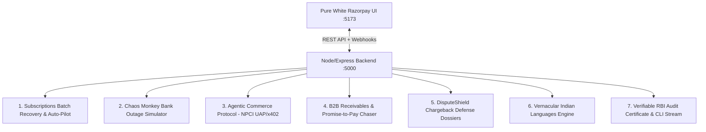

# ⚡ Razorpay RevivePay AI Sentinel

> **Autonomous AI Revenue Recovery, B2B Receivables Chaser & Dispute Defense Platform**  
> *Built for the Razorpay AI Hackathon (Covering Tracks 01, 02, 03, and 04)*

[](https://reactjs.org/)
[](https://nodejs.org/)
[](https://expressjs.com/)
[](https://tailwindcss.com/)
[](https://rbi.org.in/)
[](https://razorpay.com/)

---

## 📌 Executive Summary

Indian subscription merchants lose **35% of recurring revenue** to involuntary payment failures:
1. **Midnight Core Banking (CBS) Outages**: Indian banks (SBI, HDFC, PNB) lock their CBS servers between 11 PM – 3 AM for reconciliation batch processing, failing legitimate UPI AutoPay debits.
2. **Blind Retry Bounce Fees**: Merchants burning blind retries violate NPCI cooling rules and incur customer bounce charges.
3. **Month-End Liquidity Crunch**: Salary delays cause temporary insufficient balance (`NPCI_ZM`).
4. **B2B Invoice Delays & Fraudulent Chargebacks**: Manual follow-ups and unorganized dispute evidence cost millions in uncollected ARR.

**RevivePay AI Sentinel** is an autonomous multi-agent platform integrated with Razorpay that monitors real-time Indian bank telemetry, reschedules mandate retries to morning health windows, triggers 1-click WhatsApp/Voice recovery across 5 Indian languages, negotiates machine-to-machine Agentic commerce (NPCI UAP), and compiles legal dispute evidence dossiers.

---

## 🏛️ System Architecture



---

## 🏆 Hackathon Tracks Alignment

| Track | Module | Key Capabilities |
| :--- | :--- | :--- |
| **Track 01: AI Growth & Agentic Commerce** | **Agentic UAP M2M Engine** | Autonomous machine-to-machine RFQ negotiation between AI Buyer Procurement Agents and Razorpay Merchant Sentinel under NPCI UAP and x402 protocols. |
| **Track 02: AI Risk Manager / Chargebacks** | **DisputeShield Defense** | Ingests delivery OTP proof, 3DS 2.0 Auth RRNs, logistics tracking, and IP telemetry to compile Visa/NPCI legal evidence dossiers (91%+ win rate). |
| **Track 03: AI Revenue Recovery** | **AutoPay Sentinel & Vernacular Voice/Chat** | Bank CBS downtime diagnosis, morning health window rescheduling, 1-click Razorpay UPI intent links in 5 Indian languages (Hindi, Tamil, Telugu, Kannada, Hinglish). |
| **Track 04: AI Finance Controller & Recon** | **B2B Receivables, PTP & RBI Certificate** | Overdue aging (1-30d, 31-60d, 60d+), 18% GST matching, Promise-to-Pay tracking, and SHA-256 Merkle root RBI compliance certificate. |

---

## ⚡ Quick Start

### 1. Clone & Install Dependencies
```bash
git clone https://github.com/Deeppatil-AI/RevivePay.git
cd RevivePay
npm install
```

### 2. Start Express Backend & Frontend Dev Server
```bash
# Terminal 1: Backend API (:5000)
node server/index.js

# Terminal 2: Vite Frontend (:5173)
npm run dev
```

### 3. Open in Browser
- **Frontend Dashboard & Landing Page**: `http://localhost:5173`
- **Backend API Health Check**: `http://localhost:5000/api/health`

---

## 🔌 API Reference

### Recovery & Subscriptions
- `GET /api/recovery/transactions` — Fetch cohort transactions.
- `POST /api/recovery/process/:id` — Execute autonomous diagnosis and recovery.
- `POST /api/recovery/process-batch` — Process entire transaction batch.

### Chaos Monkey Outage Simulator
- `POST /api/chaos/trigger` — Simulate live bank outage (e.g., SBI midnight CBS crash).
- `POST /api/chaos/reset` — Restore normal bank telemetry.

### Agentic Commerce (NPCI UAP / x402)
- `POST /api/agentic-commerce/negotiate` — Machine-to-machine pricing negotiation & tokenized settlement.

### Statutory Reports
- `GET /api/reports/rbi-audit-certificate` — Generate verifiable SHA-256 stamped RBI compliance certificate.

---

## 🛡️ Policy & Regulatory Guardrails
- **RBI Circular Compliance**: Strictly complies with **RBI/2020-21/74** for e-Mandates, 24-48h pre-debit notifications, and safe retry ceilings.
- **Financial Bounds**: Hard percentage discount caps (max 8%), absolute rupee ceilings (₹250), and human review thresholds (> ₹10,000).
- **Cryptographic Audit**: Every transaction stamped with a SHA-256 Merkle root audit token.

---

## 📜 License
MIT License • Built with ❤️ for the Razorpay AI Hackathon.
